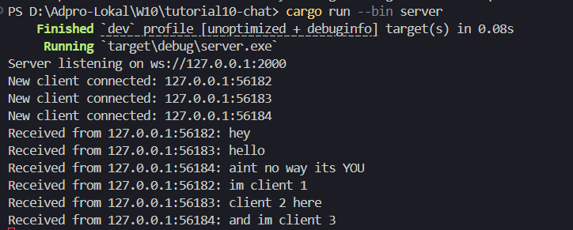
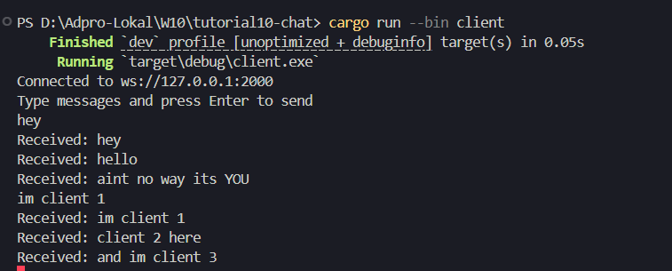
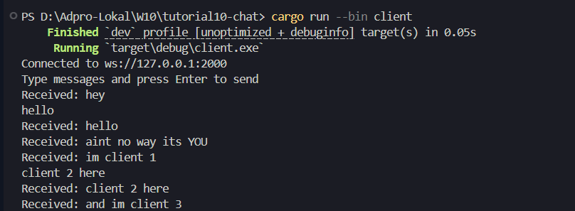
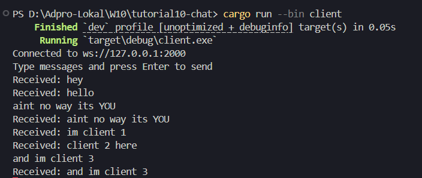
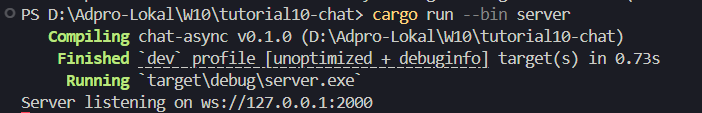
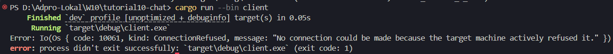
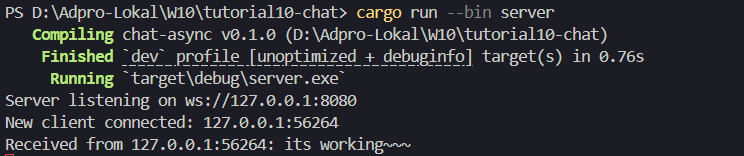
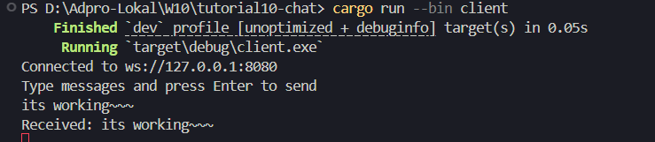
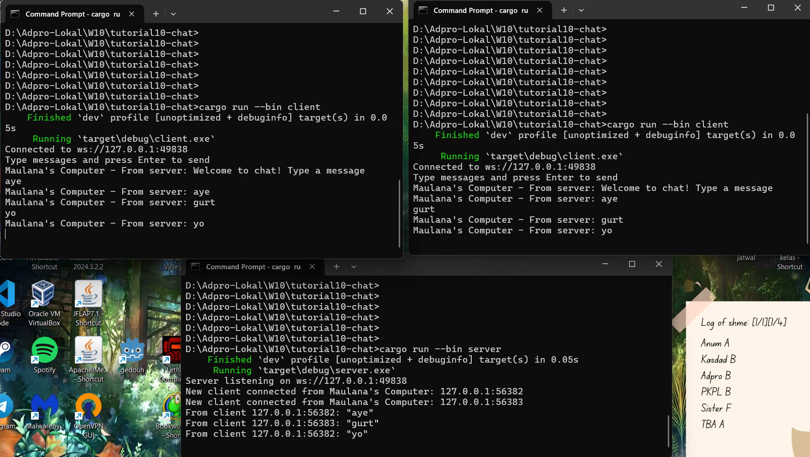

# Eksplanasi Experiment 2.1

## How to run it?
- Untuk server: `cargo run --bin server`
- Untuk klien: `cargo run --bin client`

## What happens when you type some text in the clients.
Teks akan terlihat pada server da klien lain dengan awalan: `Received: `

## Further explanation:






Awal mula, kita akan run server nya, lalu kita run juga klien 1, 2, dan 3 di terminal yang berbeda. Server akan dikabarkan saat ada klien yang terbuat/run. Selanjutnya tiap klien mengirim pesan, pada server dan klien lainnya akan ditampilkan juga dengan awalan: `Received: ` saat itu juga.

Hal tersebut terjadi karena arsitektur aplikasi ini menggunakan prinsip event-driven asynchronous programming yang dikombinasikan dengan broadcast channel di sisi server. Ketika server menerima koneksi dari klien, ia membuat salinan transmitter (`Sender`) yang akan digunakan untuk menyiarkan pesan ke semua penerima (`Receiver`) yang aktif. Setiap koneksi klien akan memiliki task async-nya sendiri yang menunggu pesan dari dua sumber: pesan dari klien tersebut (via WebSocket) dan pesan dari channel broadcast. Saat klien mengirim pesan, server menerima pesan tersebut, mencetaknya, dan menyebarkannya ke semua subscriber lain melalui channel broadcast. Karena semua koneksi mendengarkan channel ini, pesan pun langsung disampaikan ke seluruh klien lain secara asinkron.

Di sisi klien, setiap terminal klien memiliki dua aktivitas paralel: satu untuk membaca input pengguna (`stdin`), dan satu lagi untuk mendengarkan pesan dari server (`WebSocketStream`). Keduanya dijalankan secara bersamaan menggunakan `tokio::select!`, sehingga klien bisa langsung menampilkan pesan yang diterima dari server tanpa menunggu input user selesai. Inilah mengapa saat klien 1 mengirim pesan, klien lainnya dan server langsung menerima dan menampilkannya dengan awalan `Received: `. Interaktivitas ini terjadi secara realtime karena arsitektur asynchronous memungkinkan semua proses berjalan tanpa blocking satu sama lain.

# Eksplanasi Experiment 2.2

Saat port client diganti menjadi 8080, server masih bisa di run dengan baik



Namun port kliennya menjadi bermasalah



Masalah ini bisa diselesaikan dengan menerapkan port menjadi 8080 juga pada `client.rs`,
yakni pada:
```
    let listener = TcpListener::bind("127.0.0.1:2000").await?;
    println!("Server listening on ws://127.0.0.1:2000");
```




Masalah terjadi karena port yang digunakan oleh server dan client harus konsisten agar keduanya bisa saling terhubung. Ketika server diubah ke port 8080, tetapi client masih mencoba untuk terkoneksi ke port 2000, maka koneksi gagal karena tidak ada server yang mendengarkan di port tersebut. Hal ini terlihat pada kode `TcpListener::bind("127.0.0.1:2000")`, yang menunjukkan bahwa client masih mengarah ke port lama. Setelah port pada `client.rs` diubah menjadi 8080 agar sesuai dengan port server, barulah koneksi berhasil karena client sekarang mencoba terhubung ke alamat dan port yang benar di mana server aktif mendengarkan. Keselarasan alamat IP dan port ini penting dalam komunikasi jaringan untuk memastikan jalur koneksi terbentuk secara benar.

# Eksplanasi Experiment 2.3



Saya membuat perubahan pada line-line untuk print agar informasi terkait port, IP dan sumber klien dan server menjadi jelas. Karena untuk kasus pembuatan log chat informasi port, IP dan sumber sangat penting seperti untuk keperluan tracking dan lain lain.